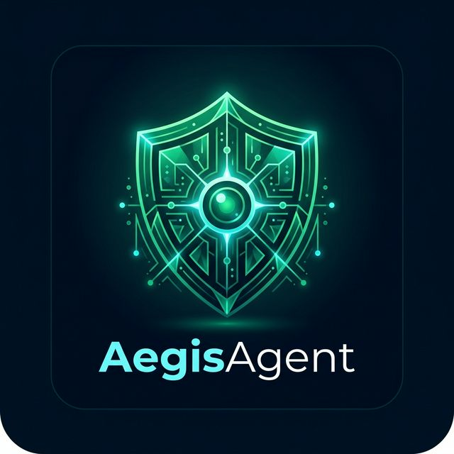
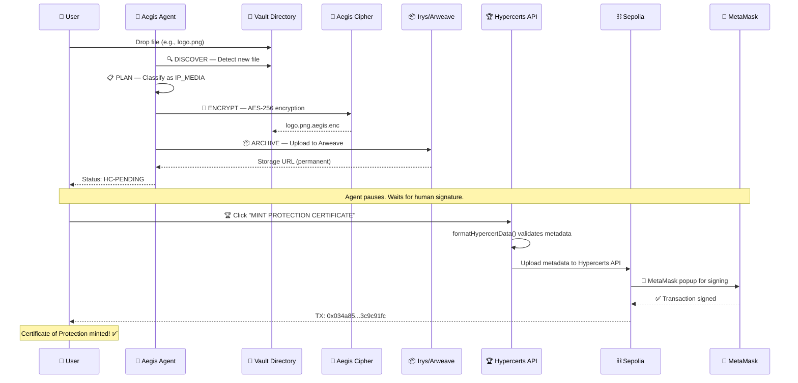

<p align="center">
  
</p>

<h1 align="center">Aegis: Autonomous ZK-Infrastructure Sentinel</h1>

<p align="center">
  <strong>The first AI agent that autonomously discovers, encrypts, and certifies your intellectual property on-chain — powered by Hypercerts.</strong>
</p>

<p align="center">
  
  
  
  
  
  
</p>

<p align="center">
  <a href="#-the-problem">Problem</a> •
  <a href="#-how-aegis-works">How It Works</a> •
  <a href="#-the-hypercert-certificate">Hypercerts</a> •
  <a href="#%EF%B8%8F-architecture">Architecture</a> •
  <a href="#-getting-started">Getting Started</a> •
  <a href="#-bounty-alignment">Bounties</a> •
  <a href="#-roadmap">Roadmap</a>
</p>

---

## 🔥 The Problem

Every day, **$2.5 trillion** worth of intellectual property is created digitally — source code, design assets, proprietary documents, medical records — yet **less than 0.1%** of it has any verifiable, timestamped proof of origin. When disputes arise, creators have no on-chain evidence that they were *first*.

> **What if an autonomous AI agent could watch over your files, encrypt them, and mint an immutable on-chain certificate of protection — before you even think about it?**

That's Aegis.

---

## 🛡️ How Aegis Works

Aegis runs a fully autonomous **6-stage security pipeline** that transforms raw, unprotected files into certified, on-chain intellectual property:

```
📁 File Detected → 🔍 AI Classification → 🔐 AES-256 Encryption → 📦 Permanent Archive → 🏆 Hypercert Minted → 🌐 Swarm Broadcast
```

The entire pipeline executes **without human intervention** — from the moment you drop a file, to the moment an on-chain Hypercert certificate is minted to your wallet.

### The 6-Stage Pipeline

| Stage | Name | Technology | What Happens |
|:---:|:---|:---|:---|
| 1 | **DISCOVER** | Python + Chokidar | Real-time filesystem monitoring detects new files in watched directories. |
| 2 | **PLAN** | Sentinel Intelligence | AI classifies each file (`IP_CODE`, `IP_MEDIA`, `PII_DATA`, `FINANCIAL`) and decides protection priority. |
| 3 | **ENCRYPT** | AES-256 Aegis Cipher | Sensitive files are encrypted with a unique AES-256 key, stored in a local `.aegis_keyring.json`. |
| 4 | **ARCHIVE** | Irys → Arweave | Encrypted data is committed to permanent, censorship-resistant storage on Arweave. |
| 5 | **CERTIFY** | **Hypercerts SDK** | **⭐ Core stage.** An on-chain Hypercert is minted to the operator's wallet, certifying the protection. |
| 6 | **SWARM** | ATProto (Bluesky) | Decision logs are broadcast to the decentralized ATProto network for transparency. |

---

## 🏆 The Hypercert Certificate

> **This is the heart of Aegis.** Every protected asset receives an on-chain [Hypercert](https://hypercerts.org) — an ERC-1155 token that serves as an immutable, verifiable **Certificate of Protection**.

### What the Hypercert Proves

Each minted Hypercert contains:

| Field | Value | Purpose |
|:---|:---|:---|
| **Name** | `AegisAgent IP Protection: {filename}` | Identifies the protected asset |
| **Work Scope** | `["AegisAgent IP Protection", "Cybersecurity"]` | Classifies the type of work performed |
| **Impact Scope** | `["all"]` | Broad impact claim for IP protection |
| **Work Timeframe** | `[discovery_timestamp, +1 year]` | When the protection was performed |
| **Impact Timeframe** | `[discovery_timestamp, +1 year]` | Duration of the impact claim |
| **Contributors** | `[operator_wallet_address]` | Who performed the protection |
| **Rights** | `["Public Display"]` | What rights the certificate grants |
| **Transfer Restriction** | `FromCreatorOnly` | Only the creator can fractionalize |
| **Total Units** | `100,000,000` | Fractionable units for future evaluation |

### Live Minting Flow



### Viewing Your Certificates

After minting, your Hypercert is visible:
- **On-chain**: [Sepolia Etherscan](https://sepolia.etherscan.io) — search your TX hash
- **Hypercerts Explorer**: [hypercerts.org](https://hypercerts.org) — your portfolio of protection certificates
- **Aegis Dashboard**: The "Protected IP" tab displays each certificate with its TX hash, asset name, and clickable verification link

### Example: Real Minted Certificate

```
✅ Hypercert Minted!
TX: 0x034a85e0ef386f494ab0b8453c84b82061f595f098014243bc2ecd2f3c9c91fc
Network: Sepolia (Chain ID: 11155111)
Asset: logo.png
Category: IP_MEDIA
Certificate: AegisAgent IP Protection: logo.png
Operator: 0xbF39...9B7B
```

---

## 🏗️ Architecture

### System Overview

```
┌──────────────────────────────────────────────────────────┐
│                    AEGIS DASHBOARD (React + Vite)         │
│  ┌─────────┐  ┌──────────┐  ┌───────────┐  ┌─────────┐ │
│  │ Landing  │  │  Mission  │  │ Protected │  │ System  │ │
│  │  Page    │  │  Control  │  │    IP     │  │  Logs   │ │
│  └────┬─────┘  └────┬─────┘  └─────┬─────┘  └────┬────┘ │
│       └──────────────┴──────────────┴─────────────┘      │
│                          │                                │
│              ┌───────────┴───────────┐                   │
│              │   useAegisAgent Hook  │                   │
│              │  (State + Lifecycle)  │                   │
│              └───────────┬───────────┘                   │
│                          │ REST API                      │
├──────────────────────────┼───────────────────────────────┤
│              ┌───────────┴───────────┐                   │
│              │   Express API Bridge  │  ← server.js      │
│              │   (Port 3001)         │                   │
│              └───────────┬───────────┘                   │
│                          │ spawn()                       │
│              ┌───────────┴───────────┐                   │
│              │  Python Orchestrator  │  ← main.py        │
│              │  (Autonomous Brain)   │                   │
│              └───────────┬───────────┘                   │
│                          │ ts-node                       │
│              ┌───────────┴───────────┐                   │
│              │  TypeScript Pipeline  │  ← src/index.ts   │
│              │  ┌──────┐ ┌────────┐  │                   │
│              │  │Cipher│ │ Irys   │  │                   │
│              │  │AES256│ │Storage │  │                   │
│              │  ├──────┤ ├────────┤  │                   │
│              │  │ ZK   │ │Identity│  │                   │
│              │  │Proof │ │ERC8004 │  │                   │
│              │  ├──────┤ ├────────┤  │                   │
│              │  │Impact│ │ATProto │  │                   │
│              │  │Hyper │ │ Swarm  │  │                   │
│              │  └──────┘ └────────┘  │                   │
│              └───────────────────────┘                   │
└──────────────────────────────────────────────────────────┘
```

### Key Modules

| File | Purpose |
|:---|:---|
| `main.py` | Python autonomous orchestrator — manages cycles, retries, and structured logging |
| `server.js` | Express API bridge — file upload, SSE events, process spawning |
| `src/index.ts` | TypeScript core pipeline — executes all 6 stages per file |
| `src/intelligence.ts` | ML-driven sensitivity classification (IP_CODE, IP_MEDIA, PII_DATA, FINANCIAL) |
| `src/zk_proof.ts` | Zero-knowledge proof generation for data integrity verification |
| `src/irys_storage.ts` | Arweave permanent storage via Irys SDK |
| `src/identity.ts` | ERC-8004 on-chain agent identity registration |
| `src/impact.ts` | Hypercert impact receipt generation (HC-PENDING → frontend mint) |
| `src/atproto_swarm.ts` | ATProto decision log broadcasting (Bluesky network) |
| `web/src/components/MintHypercertButton.tsx` | Frontend wallet interaction — triggers MetaMask signing for Hypercert |

---

## 🌍 Real-World Impact: Why This Matters

### 🕵️ Whistleblower Protection
A journalist receives leaked documents. Aegis autonomously encrypts them, archives them permanently on Arweave, and mints a Hypercert proving the documents existed at a specific timestamp — **without revealing the whistleblower's identity** or the actual document contents.

### 🏥 Decentralized Medical Identity
A patient's medical records need to be verified across healthcare providers. Aegis scans the records, encrypts them with AES-256, and mints a Hypercert that proves the validity and timestamp of the records — **without exposing the actual health data**.

### 🎨 Creator IP Protection
A digital artist drops their new artwork into a watched folder. Within 60 seconds, Aegis has encrypted it, archived it on Arweave, and minted an on-chain Hypercert — creating **irrefutable proof of creation date** in case of future copyright disputes.

### 📰 War-Zone Journalism
A human rights journalist in a conflict zone captures evidence of violations. Aegis immediately archives the evidence to censorship-resistant storage and mints a certificate — **before the devices can be confiscated or destroyed**.

---

## 🛠️ Tech Stack & Bounties

| Layer | Technology | Bounty Track |
|:---|:---|:---|
| **Autonomy** | Python 3.10 + TypeScript | Ethereum Foundation — **Agent Only** |
| **Intelligence** | Sentinel ML Classification | Autonomous ML Classification |
| **Privacy** | AES-256 Aegis Cipher + Noir ZK | Protocol Labs — **Digital Rights** |
| **Infrastructure** | Arweave via Irys SDK | Protocol Labs — **Infrastructure** |
| **Identity** | ERC-8004 (Sepolia) | Ethereum Foundation — **Agents With Receipts** |
| **Impact** | **Hypercerts SDK v2.9** | **Hypercerts — Impact Evaluation** |
| **Swarm** | ATProto (Bluesky) | Decentralized Trust Layer |
| **Frontend** | React + Vite + RainbowKit | Enterprise Dashboard |

---

## 🎯 Bounty Alignment

### 🏆 Hypercerts — Impact Evaluation (Primary Focus)

Aegis is built **Hypercerts-first**. Every single protection action results in an on-chain Hypercert minted to the operator's wallet using the `@hypercerts-org/sdk` v2.9.1. We use the official `formatHypercertData()` helper to generate validated metadata, then call `mintHypercert()` with `TransferRestrictions.FromCreatorOnly` and 100M fractionable units. The Hypercert serves as the **permanent, verifiable, on-chain certificate of protection** — the single source of truth for IP provenance.

**Live Proof:** TX `0x034a85e0ef386f494ab0b8453c84b82061f595f098014243bc2ecd2f3c9c91fc` on Sepolia.

### 🔷 Ethereum Foundation — Agent Only + Agents With Receipts

Aegis is a fully autonomous Python agent with a structured `agent.json` manifest, ERC-8004 on-chain identity, and a transparent `agent_log.json` audit trail. Every decision is logged, every action is verifiable, and the agent's identity is registered on Sepolia at `0xf66e7CBdAE1Cb710fee7732E4e1f173624e137A7`.

### 🌐 Protocol Labs — Digital Rights + Infrastructure

Aegis directly protects digital human rights by encrypting sensitive data with AES-256 and archiving it permanently on Arweave via Irys. The encrypted data is immutable, censorship-resistant, and time-stamped — fulfilling the core mission of Protocol Labs' decentralized infrastructure.

---

## 🚀 Getting Started

### Prerequisites

- **Node.js** v18+ and **npm**
- **Python** 3.10+ with `venv`
- **MetaMask** browser extension (connected to Sepolia testnet)
- **Sepolia ETH** for gas fees ([faucet](https://sepoliafaucet.com))

### Installation

```bash
# 1. Clone the repository
git clone https://github.com/IrrhammCode/AegisAgent.git
cd AegisAgent

# 2. Install Node.js dependencies (backend + frontend)
npm install
cd web && npm install && cd ..

# 3. Create Python virtual environment
python3 -m venv venv
source venv/bin/activate
pip install -r requirements.txt

# 4. Configure environment
cp .env.example .env
# Edit .env with your keys (see below)
```

### Environment Configuration (`.env`)

```env
# ─── Required ─────────────────────────────────────────────
ETH_RPC_URL=https://sepolia.infura.io/v3/YOUR_INFURA_KEY
OPERATOR_PRIVATE_KEY=0xYOUR_PRIVATE_KEY
ERC8004_REGISTRY=0xf66e7CBdAE1Cb710fee7732E4e1f173624e137A7

# ─── Arweave Storage ─────────────────────────────────────
IRYS_NODE=https://devnet.irys.xyz
IRYS_TOKEN=ethereum

# ─── Hypercerts ───────────────────────────────────────────
HYPERCERTS_ENV=test

# ─── ATProto (Bluesky) ───────────────────────────────────
ATP_HANDLE=your-handle.bsky.social
ATP_PASSWORD=your-app-password
ATP_PDS_URL=https://bsky.social

# ─── Auto-Discovery ──────────────────────────────────────
SCAN_DIRECTORIES=./vault_data
MAX_SCAN_FILE_SIZE=5242880
```

### Running Aegis

```bash
# Start the backend API + agent
npm start

# In a separate terminal, start the dashboard
cd web && npm run dev
```

Then open **http://localhost:5173** in your browser.

### Quick Demo

1. Connect your MetaMask wallet (Sepolia network)
2. Click "Enter Dashboard"
3. Upload any file (e.g., an image, source code, document)
4. Watch the 6-stage pipeline execute automatically
5. When the gold "⏳ Awaiting Wallet Signature" banner appears, click **MINT PROTECTION CERTIFICATE**
6. Sign the transaction in MetaMask
7. Your Hypercert is minted! 🎉

---

## 📊 Example Output

### `agent_log.json` (Structured Decision Log)

```json
[
  {
    "timestamp": "2026-04-01T06:12:33.421Z",
    "cycle": 1,
    "step": "DISCOVER",
    "decision": "Scanned /vault_data: found 3 new file(s).",
    "status": "SUCCESS"
  },
  {
    "timestamp": "2026-04-01T06:12:45.891Z",
    "cycle": 1,
    "step": "VERIFY",
    "decision": "Protection verified for logo.png",
    "details": {
      "file_hash": "a7f3b2c91d...",
      "classification": "IP_MEDIA",
      "storage_url": "https://devnet.irys.xyz/tx/...",
      "impact_token": "HC-PENDING"
    },
    "status": "SUCCESS"
  }
]
```

### Smart Contracts & Deployed Addresses (Sepolia)

| Contract | Address | Purpose |
|:---|:---|:---|
| ERC-8004 Identity Registry | `0xf66e7CBdAE1Cb710fee7732E4e1f173624e137A7` | Agent identity registration |
| ERC-8004 Reputation Registry | `0x6E2a285294B5c74CB76d76AB77C1ef15c2A9E407` | Agent reputation tracking |
| ERC-8004 Validation Registry | `0xC26171A3c4e1d958cEA196A5e84B7418C58DCA2C` | Action validation |
| Hypercerts (Sepolia) | [Deployed by SDK](https://sepolia.etherscan.io) | Certificate minting |

---

## 🗺️ Roadmap

| Phase | Timeline | Milestone |
|:---|:---|:---|
| ✅ **v1.0 — Sentinel** | Q1 2026 | Core 6-stage pipeline, AES-256 encryption, local file monitoring |
| ✅ **v1.5 — Hypercert Integration** | Q2 2026 | On-chain Hypercert minting via MetaMask, enterprise dashboard |
| 🔄 **v2.0 — Swarm Intelligence** | Q3 2026 | Multi-agent coordination, cross-machine protection, decentralized swarm via ATProto |
| 📋 **v2.5 — Mainnet** | Q4 2026 | Ethereum mainnet deployment, production Hypercerts, real Arweave archival |
| 🌐 **v3.0 — AegisDAO** | 2027 | Fractionalized Hypercerts for community-driven IP evaluation, governance token |

---

## 📁 Project Structure

```
AegisAgent/
├── main.py                 # Python autonomous orchestrator
├── server.js               # Express API bridge (port 3001)
├── agent.json              # Machine-readable agent manifest
├── agent_log.json          # Structured execution logs
├── vault_data/             # Watched directory for file protection
├── src/
│   ├── index.ts            # TypeScript core pipeline
│   ├── intelligence.ts     # ML classification engine
│   ├── zk_proof.ts         # Zero-knowledge proof generation
│   ├── irys_storage.ts     # Arweave permanent storage
│   ├── identity.ts         # ERC-8004 agent identity
│   ├── impact.ts           # Hypercert impact receipts
│   └── atproto_swarm.ts    # ATProto swarm broadcasting
├── web/
│   ├── src/
│   │   ├── App.tsx
│   │   ├── components/
│   │   │   ├── Dashboard.tsx
│   │   │   ├── MintHypercertButton.tsx  # ⭐ Wallet minting
│   │   │   ├── LandingPage.tsx
│   │   │   └── Navbar.tsx
│   │   └── hooks/
│   │       └── useAegisAgent.tsx        # Agent lifecycle hook
│   └── index.html
└── .env                    # Configuration (see above)
```

---

## ⚖️ License

MIT License — 2026 Aegis Team.

Built with 🛡️ for [PL_Genesis 2026](https://plgenesis.com) by [@IrrhammCode](https://github.com/IrrhammCode).
